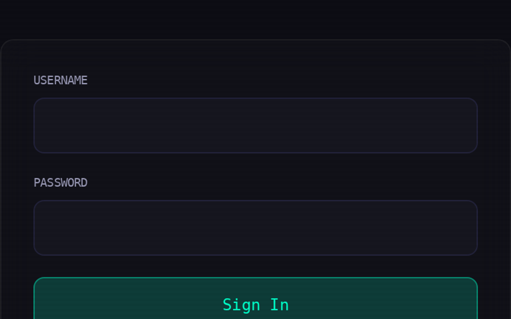
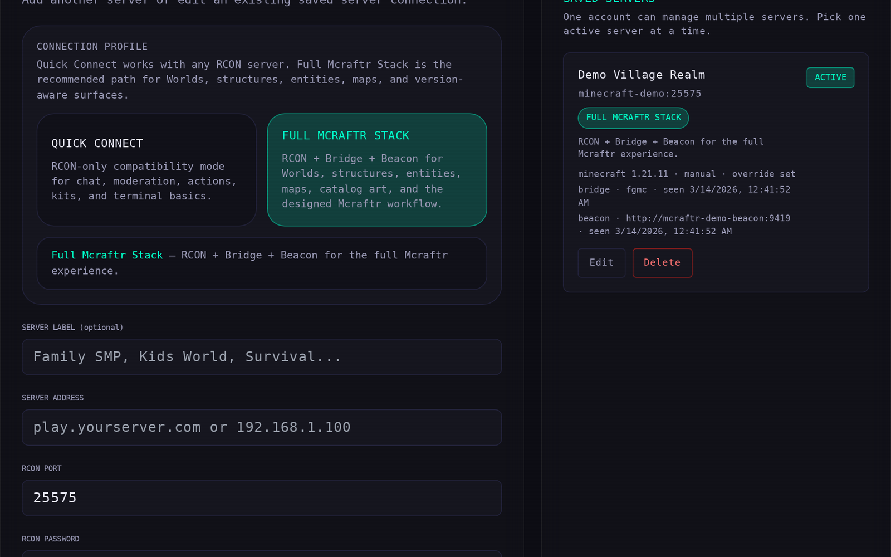
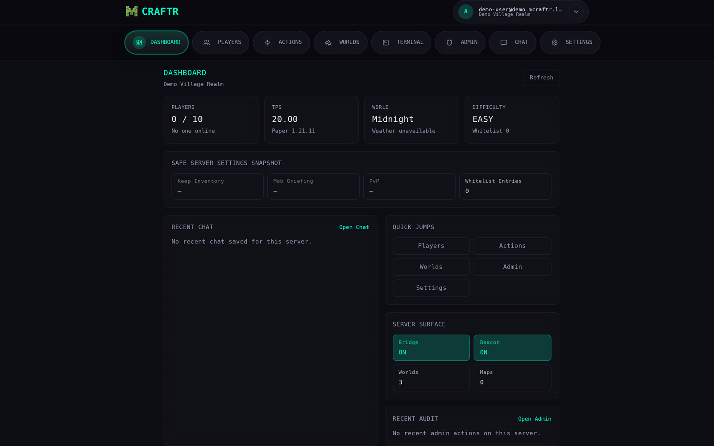
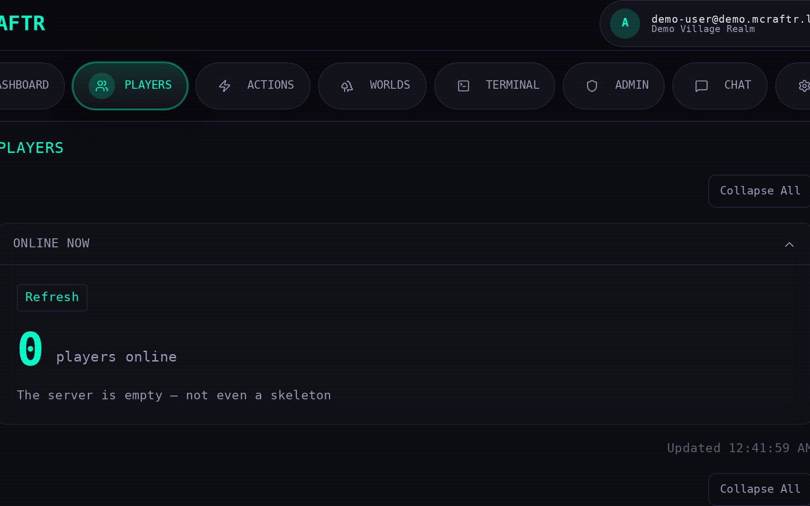
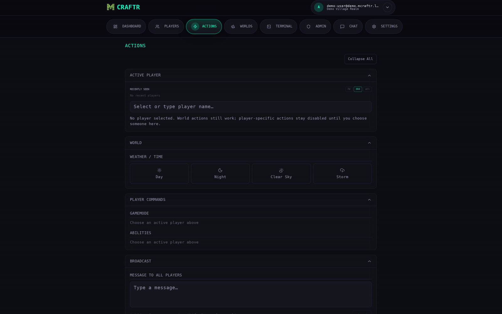
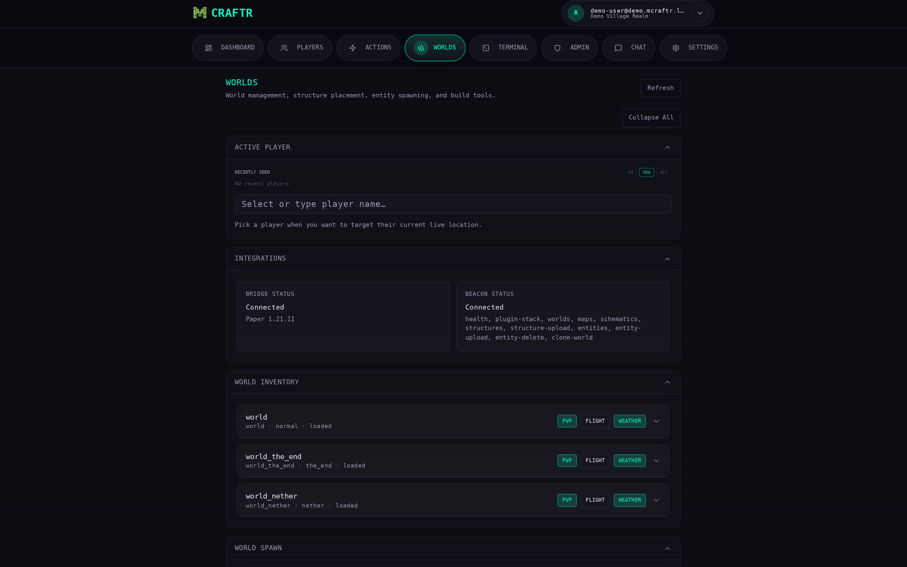
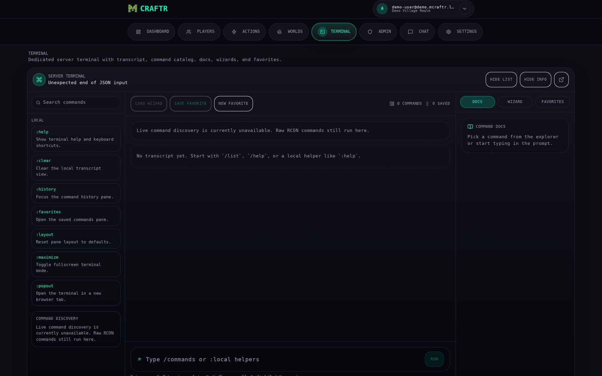
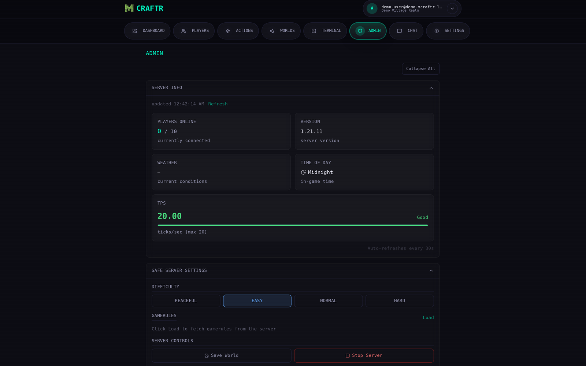
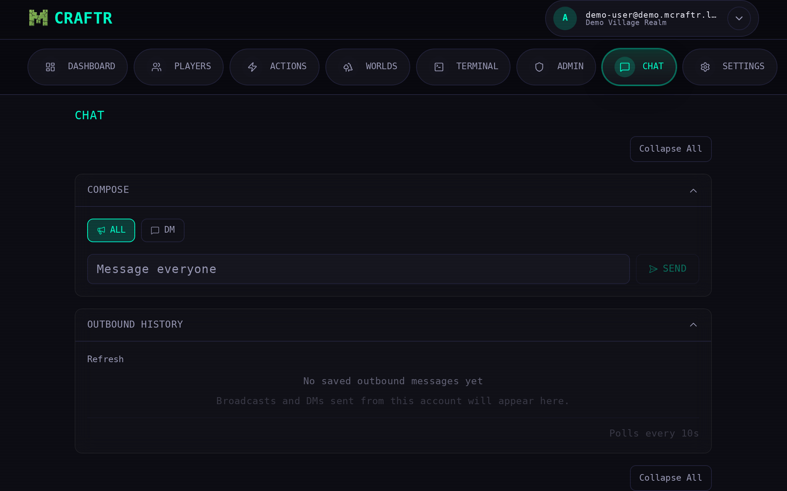
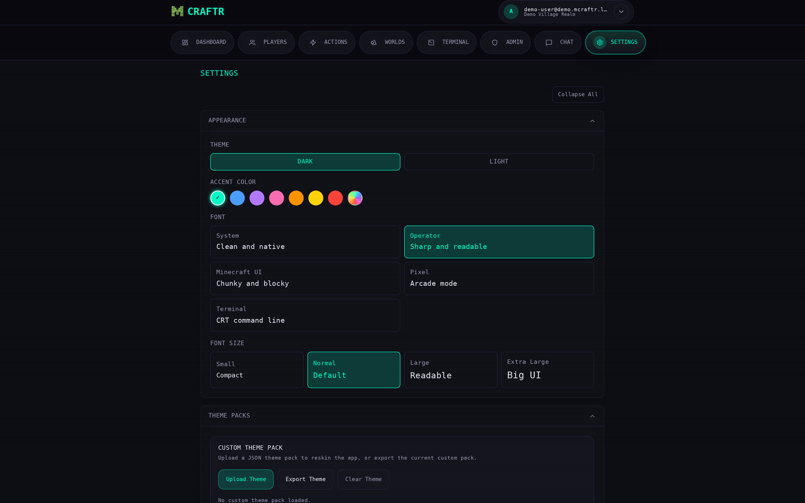

# Mcraftr

Mcraftr is a self-hosted Minecraft admin panel built for fast, opinionated server management over RCON. It gives you a polished web UI for moderation, player tools, server actions, chat, schedules, theming, and account management without turning into a full host-control panel.

Mcraftr supports two connection profiles:

- `Quick Connect` — RCON-only compatibility mode for broad server support
- `Full Mcraftr Stack` — RCON + Bridge + Beacon for the experience Mcraftr is designed around

It is designed around a simple model:

- Mcraftr talks to Minecraft through RCON.
- Accounts live in Mcraftr.
- One Mcraftr account can manage multiple saved servers.
- One browser can keep multiple Mcraftr accounts available for quick switching.

## Repository Screenshots

The repository includes a curated desktop screenshot set in `docs/screenshots/highlights/`.












## What Mcraftr Does Well

### Dashboard

- Default landing tab with current server status
- Online player count and quick recent activity
- TPS, version, weather, and time snapshot
- Fast deep-links into the rest of the app

### Players

- Live player list
- Session, vitals, location, and effects panels
- Inventory inspection and item deletion
- Admin player directory and recent player context

### Actions

- Day/night and weather controls
- Gamemode, abilities, and teleport tools
- Item catalog with quantity and stack-aware give controls
- Built-in kit assignment
- Custom kit builder with saved reusable kits

### Chat

- Chat history panel
- Broadcast as `[Admin]`
- Direct messages as `[Admin -> You]`
- Chat send flow from the panel itself

### Admin

- Moderation tools: kick, ban, pardon, whitelist, op
- Server terminal
- Rules, difficulty, and curated gamerules
- Scheduled recurring actions
- Audit history
- User management and feature-policy controls

### Settings / Personalization

- Dark/light mode
- Accent presets plus custom accent picker
- Theme pack import/export
- Font family and font size controls
- Built-in and custom sound effects
- Built-in and custom background music
- Built-in or uploaded profile pictures

## Current Product Shape

Mcraftr is intentionally not a generic hosting controller.

It does **not** currently try to be:

- a file manager
- a plugin installer
- a host/Docker manager
- a generic backup orchestrator
- a world-creation/provisioning suite

It is best when used as a focused Minecraft operations panel sitting in front of one or more existing servers.

## Highlights

- Built with `Next.js 15`, `React 19`, `TypeScript`, `SQLite`, `Redis`, and `rcon-client`
- Multiple saved Minecraft servers per Mcraftr account
- Multiple saved Mcraftr accounts per browser/device
- Per-user feature flags, including subfeatures like `Custom Kit Builder`
- Local theme packs and audio customization without touching server code
- Docker-first deployment with Redis and persistent SQLite data

## Screens at a Glance

- `Dashboard`
- `Players`
- `Actions`
- `Worlds`
- `Terminal`
- `Admin`
- `Chat`
- `Settings`

Most major sections are collapsible so long pages stay manageable.

## Screenshot Capture (Maintainers)

To refresh repository screenshots safely in a local demo environment:

```bash
PORT=3054 \
NEXTAUTH_URL=http://127.0.0.1:3054 \
NEXTAUTH_SECRET=demo-nextauth-secret \
MCRAFTR_ENC_KEY=demo-encryption-secret \
MCRAFTR_ADMIN_USER=demo@mcraftr.local \
MCRAFTR_ADMIN_PASS=demo-password \
DATA_DIR=.demo-data \
REDIS_URL=redis://127.0.0.1:6379 \
npm run dev

PLAYWRIGHT_BASE_URL=http://127.0.0.1:3054 \
PLAYWRIGHT_ADMIN_EMAIL=demo@mcraftr.local \
PLAYWRIGHT_ADMIN_PASSWORD=demo-password \
npm run pw:screenshots:highlights
```

## Multi-Account and Multi-Server Model

### Accounts

Mcraftr accounts are application users, not Minecraft players.

- Each account signs into Mcraftr with email + password.
- The browser can keep several Mcraftr accounts saved for quick switching.
- Saved device accounts are stored in cookies with an encrypted secure store.
- You can forget a saved account from the profile menu at any time.

### Servers

Each Mcraftr account can save multiple Minecraft servers.

- One account can manage multiple RCON targets.
- One active server is selected at a time.
- The header profile menu lets you switch active server quickly.
- Operational data such as audit history, player sessions, chat logs, and schedules are scoped to the active saved server.

## Deployment

Mcraftr is easiest to install with Docker Compose.

For a step-by-step install walkthrough, see [`INSTALL.md`](INSTALL.md).

### Install Matrix

Mcraftr does not require Dokploy.

Supported deployment styles today:

| Path | Best for | Status |
| --- | --- | --- |
| `docker compose` local build | Most users on a VPS or home server | Recommended default |
| `docker compose` with a prebuilt image | Users who want to avoid local builds | Supported |
| Dokploy | Users already running Dokploy | Supported |
| Any platform that can run Docker images | Advanced users on other PaaS/container platforms | Supported with your platform's own wiring |
| Plain Node runtime | Development only | Possible, but not the easiest install |

### What You Need

- Docker
- Docker Compose
- one reachable Minecraft RCON endpoint

Mcraftr brings its own app container, Redis, and SQLite storage.

### Fastest Setup: Quick Connect

This is the best path for most people getting started.

1. Clone the repo.
2. Generate a local `.env` file with random secrets:

```bash
npm run setup:env
```

3. Open `.env` and change at least:

- `NEXTAUTH_URL`
- `MCRAFTR_ADMIN_USER`
- `MCRAFTR_ADMIN_PASS` if you want your own password instead of the generated one

4. Start Mcraftr:

```bash
docker compose up -d --build
```

5. Open:

```text
http://localhost:3054
```

6. Log in with the admin account from `.env`.
7. Add your Minecraft server in `Quick Connect` mode with:

- server address
- RCON port
- RCON password
- optional Minecraft version override

That gets you a working Mcraftr install without Bridge or Beacon.

### Quick Connect With a Prebuilt Image

If you publish or receive a prebuilt Mcraftr image, you can skip local Docker builds and run:

```bash
cp .env.example .env
# edit .env
export MCRAFTR_IMAGE=registry.example.com/mcraftr:latest
docker compose -f deploy/compose/quick-connect.image.compose.yaml up -d
```

This uses the image-based compose template in `deploy/compose/quick-connect.image.compose.yaml`.

### Full Mcraftr Stack

Use this when you want the full designed experience:

- `RCON` for core server access
- `Bridge` for typed world and server operations
- `Beacon` for catalogs, maps, previews, and filesystem-backed world context

In the connect screen, choose `Full Mcraftr Stack` and fill in:

- RCON connection
- Bridge command prefix
- Beacon URL
- Beacon token if required
- structure and entity preset roots if you use them

If you want to run the full stack from a prebuilt image, use:

```bash
cp .env.example .env
# edit .env and set MCRAFTR_IMAGE plus MCRAFTR_MINECRAFT_DATA
export MCRAFTR_IMAGE=registry.example.com/mcraftr:latest
docker compose -f deploy/compose/full-stack.image.compose.yaml up -d
```

Important for the full-stack image template:

- `MCRAFTR_MINECRAFT_DATA` must point at the host path containing your Minecraft server data directory
- Beacon mounts that path read-only so it can scan worlds, schematics, and entity presets
- your Minecraft server and Mcraftr must be on a network path where RCON is reachable

### Docker Compose Details

The included `docker-compose.yml` is self-contained and publishes Mcraftr on:

```text
127.0.0.1:3054 -> 3050
```

Persistent data is stored in:

```text
./data
```

Useful commands:

```bash
docker compose up -d --build
docker compose logs -f mcraftr
docker compose down
```

If you prefer image-based Compose instead of local builds:

```bash
docker compose -f deploy/compose/quick-connect.image.compose.yaml up -d
```

### Updating

To update an existing Docker Compose install:

```bash
git pull
docker compose up -d --build
```

### Dokploy

This repo includes Dokploy raw-compose templates in `deploy/dokploy/` and a deployment script:

```bash
npm run dokploy:deploy
```

Required environment for the deploy script:

- `DOKPLOY_BASE_URL`
- `DOKPLOY_API_KEY`
- `NEXTAUTH_SECRET`
- `NEXTAUTH_URL`
- `MCRAFTR_ADMIN_USER`
- `MCRAFTR_ADMIN_PASS`
- `MCRAFTR_ENC_KEY`
- `REDIS_PASSWORD`

By default the script targets:

- project `mcraftr`
- environment `production`
- compose stack `mcraftr-p9t6c`
- host bind `127.0.0.1:3054 -> 3050` for local Caddy on `psalmbox`

Image mode:

```bash
export DOKPLOY_DEPLOY_MODE=image
export MCRAFTR_IMAGE=registry.example.com/mcraftr:latest
npm run dokploy:deploy
```

Build-context mode:

```bash
export DOKPLOY_DEPLOY_MODE=build-context
export MCRAFTR_BUILD_CONTEXT_URL=https://example.com/mcraftr.tar.gz
npm run dokploy:deploy
```

### Other Container Platforms

Mcraftr can also run on platforms like Coolify, Portainer, Railway, Render, Fly.io, or Kubernetes if they can:

- run the Mcraftr image
- run Redis or connect to an existing Redis instance
- persist `/app/data`
- expose port `3050`
- optionally run Beacon as a second process/container for the Full Mcraftr Stack

The minimum runtime contract is:

- one `mcraftr` container
- one Redis connection
- persistent storage for `/app/data`
- env vars from `.env.example`

If the platform cannot run multi-container apps directly, Mcraftr still works in `Quick Connect` mode as long as Redis is available.

Platform-specific guides:

- [Install on Coolify](docs/install-coolify.md)
- [Install on Portainer](docs/install-portainer.md)

### Development

```bash
npm install
npm run dev
```

Local development runs through Next.js.

## Minecraft Server Requirements

Mcraftr always requires RCON.

In `server.properties`:

```properties
enable-rcon=true
rcon.port=25575
rcon.password=your-secure-password
```

`Quick Connect` works with plain RCON and keeps Mcraftr broadly accessible.

`Full Mcraftr Stack` is the recommended path and unlocks the designed Mcraftr workflow:

- Bridge for typed world and server operations
- Beacon for filesystem-backed catalogs, maps, previews, and world context

Mcraftr only manages what the Minecraft server and installed integrations actually support.

## Environment Variables

These are the important runtime variables used by the app today.

| Variable | Required | Purpose |
| --- | --- | --- |
| `NEXTAUTH_SECRET` | Yes | Session/JWT signing and device-account encryption key derivation |
| `MCRAFTR_ADMIN_USER` | Yes | Bootstrap admin email |
| `MCRAFTR_ADMIN_PASS` | Yes | Bootstrap admin password |
| `MCRAFTR_ENC_KEY` | Yes | Encrypt stored RCON passwords at rest |
| `REDIS_URL` | Yes | Redis connection string |
| `DATA_DIR` | No | Directory for SQLite data, defaults to app-local storage |
| `ALLOW_REGISTRATION` | No | Set `true` to allow public registration |

Example:

```bash
NEXTAUTH_SECRET=replace-me
MCRAFTR_ADMIN_USER=admin@example.com
MCRAFTR_ADMIN_PASS=replace-me
MCRAFTR_ENC_KEY=replace-me
REDIS_URL=redis://:replace-me@mcraftr-redis:6379
DATA_DIR=/app/data
ALLOW_REGISTRATION=false
```

## Build and Runtime Notes

- `npm run build` performs a production Next.js build.
- The Docker image uses a multi-stage build and runs as a non-root user.
- `better-sqlite3` is compiled in Alpine-compatible build stages for the final image.
- The schedule runner is in-process inside the Mcraftr app.

## Features by Area

### Dashboard

- Fast aggregate API for the active server
- Current server state without switching tabs
- Recent operational context

### Players

- Online player list
- Session stats
- Health / hunger / XP
- Coordinates and spawn context
- Effect viewer

### Actions

- World controls
- Player controls
- Teleport
- Item catalog
- Built-in kit assignment
- Custom kit builder
- Inventory tools

### Chat

- Read chat history
- Broadcast
- DM player from the panel
- Delete saved outbound messages from history

### Admin

- Server info
- Rules and difficulty
- Server controls
- Moderation
- Whitelist
- Operator management
- Schedules
- Server terminal
- Audit log
- User management
- Feature policies

### Settings

- Appearance
- Theme packs
- Font family
- Font size
- Audio
- Profile avatar
- Account update
- Server management

## Feature Policies

Mcraftr supports per-user feature gating.

Current policy categories:

- `Navigation Tabs`
- `Actions`
- `Players`
- `Chat`
- `Admin`

Important subfeatures can be controlled independently. For example, `Custom Kit Builder` can be disabled without disabling all kit assignment.

## Schedules

Schedules are server-scoped and admin-facing.

Current schedule model is intentionally curated rather than arbitrary:

- broadcast
- save-all
- time/day-night
- weather
- difficulty
- selected gamerules

Cadences supported:

- daily
- weekly
- monthly

Missed jobs are not replayed in a backlog after downtime.

## Custom Theme Packs

Mcraftr supports import/export of simple JSON theme packs from the Settings page.

Theme packs are:

- client-side preferences
- stored in browser local storage
- safe and intentionally constrained

They are **not** arbitrary CSS bundles.

### What a Theme Pack Can Change

Valid theme variable keys:

- `--bg`
- `--bg2`
- `--panel`
- `--border`
- `--text`
- `--text-dim`
- `--red`

Optional top-level field:

- `accent`

Optional metadata:

- `name`

### Validation Rules

Mcraftr currently expects:

- JSON object
- `vars` object containing one or more valid keys
- optional `accent`
- all colors must be full 6-digit hex values like `#1a2b3c`
- invalid keys are ignored
- invalid colors are ignored
- if the pack has no valid variables and no valid accent, import is rejected

### Theme Pack Format

```json
{
  "name": "Basalt Terminal",
  "accent": "#7df9ff",
  "vars": {
    "--bg": "#0d1117",
    "--bg2": "#161b22",
    "--panel": "#11161d",
    "--border": "#273344",
    "--text": "#f0f6fc",
    "--text-dim": "#9fb0c3",
    "--red": "#ff5f56"
  }
}
```

### How to Build a Good Theme Pack

Use this approach:

1. Start from a screenshot of the current UI and decide the mood first.
2. Pick `--bg` and `--bg2` as the page foundation.
3. Set `--panel` so cards still stand out against the page background.
4. Keep `--border` visible enough to preserve structure.
5. Make `--text` high-contrast.
6. Make `--text-dim` clearly secondary but still readable.
7. Set `accent` to the interactive highlight color you want.

Recommended rule:

- keep contrast high
- avoid muddy `--panel` / `--bg` combinations
- test both the header and dense cards before sharing a theme

### What Theme Packs Cannot Do

Theme packs currently cannot:

- inject custom CSS
- replace component layouts
- change typography beyond the separate font controls
- override motion behavior
- change icons
- bundle scripts

### Import / Export Flow

In the app:

1. Open `Settings`
2. Go to the appearance/theme area
3. Import a `.json` file, or export your current theme as `mcraftr-theme.json`

## Fonts

Built-in font modes:

- `System`
- `Operator`
- `Minecraft UI`
- `Pixel`
- `Terminal`

Built-in font sizes:

- `Small`
- `Normal`
- `Large`
- `Extra Large`

## Audio

### Built-in Sound Effects

- `UI Click`
- `Success Orb`
- `Notify Pling`
- `Villager No`

### Built-in Music

- `Dry Hands`
- `Living Mice`
- `Mice on Venus`

Users can also:

- upload audio files
- point sound slots at direct web audio URLs
- build their own music track list
- turn all sound off
- disable individual sound effects
- disable music separately

Audio and music settings are browser-local preferences.

## Profile Avatars

Users can:

- use the default letter avatar
- choose a built-in Minecraft-themed avatar
- upload a custom avatar
- unset later and return to the letter avatar

Built-in avatar set currently includes:

- Creeper
- Grass Block
- Diamond Pickaxe
- Redstone
- Slime
- Nether Star

## Security Notes

- RCON passwords are encrypted at rest
- Mcraftr authentication is session-based
- Saved device accounts use encrypted secure cookies
- Admin-only routes are enforced server-side
- Rate limiting is applied around sensitive command paths

## Main API Areas

This is not a full endpoint dump, but these are the major areas:

- `/api/auth/*`
- `/api/account/*`
- `/api/server`
- `/api/servers/*`
- `/api/players`
- `/api/minecraft/*`
- `/api/admin/*`

The codebase is the source of truth for the exact route surface.

## Tech Stack

| Layer | Technology |
| --- | --- |
| Framework | Next.js 15 |
| UI | React 19 |
| Language | TypeScript |
| Auth | NextAuth |
| Database | SQLite via `better-sqlite3` |
| Cache / rate limiting | Redis |
| Minecraft transport | RCON via `rcon-client` |
| Styling | Tailwind CSS |
| Icons | Lucide React |

## License

MIT. See [LICENSE](./LICENSE).
